# Tugas Praktikum Sistem Cerdas Handwritten digit recognizer

## Latar Belakang

Ngrok adalah sebuah perangkat lunak (software) yang digunakan untuk membuat terowongan (tunnel) aman (secure) antara jaringan publik (public network) dan jaringan pribadi (private network). Ngrok dapat digunakan untuk membuat terowongan pada port lokal komputer atau server, sehingga memungkinkan akses dari luar jaringan.

AR.js Studio adalah sebuah platform pengembangan (development platform) untuk membuat aplikasi augmented reality (AR) berbasis web. Platform ini memanfaatkan teknologi AR.js, yaitu sebuah library open-source yang digunakan untuk membangun pengalaman augmented reality pada browser web tanpa memerlukan plugin tambahan.

### Nama Mahasiswa
1. Rafitajudin (21220002)

<br/>
<br/>

## Requirements and installation
To install xampp, ngrok

## Running
manually by running:

```bash
> Terminal CMD ngrok http 80
```

Download file AR.Js Studio pada link Github
https://github.com/AR-js-org/studio
<p align="center">
    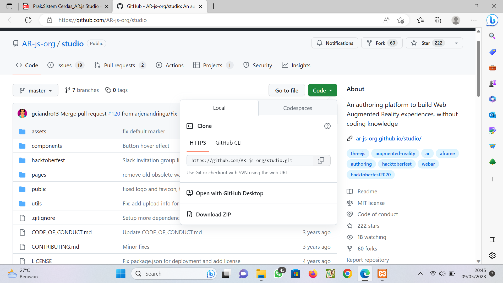
    <br>
 </p>
 
buka file index.html 
<p align="center">
    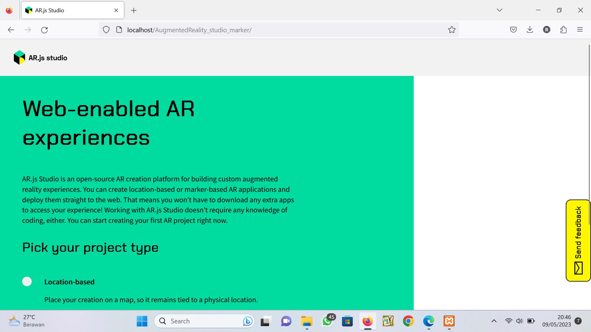
    <br>
 </p>
 
pilih seperti pada gambar lalu klik strat building
<p align="center">
    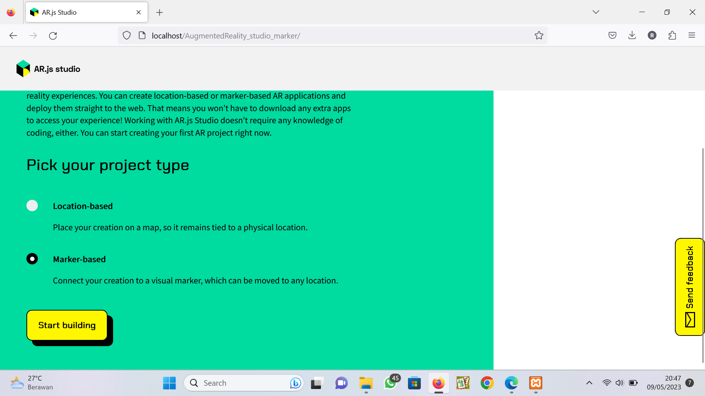
    <br>
 </p>
 
upload gambar yang akan di gunakan lalu download
<p align="center">
    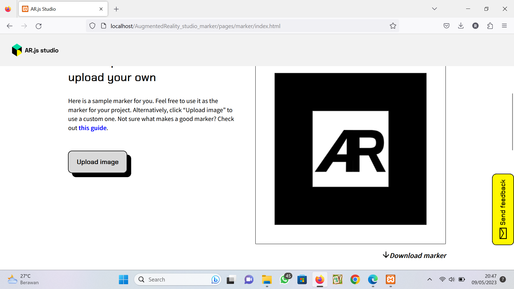
    <br>
 </p>
 <p align="center">
    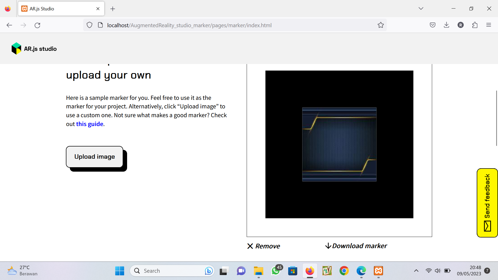
    <br>
 </p>

upload gambar yang akan dimunculkan pada gambar pertama yang di upload tadi
 <p align="center">
    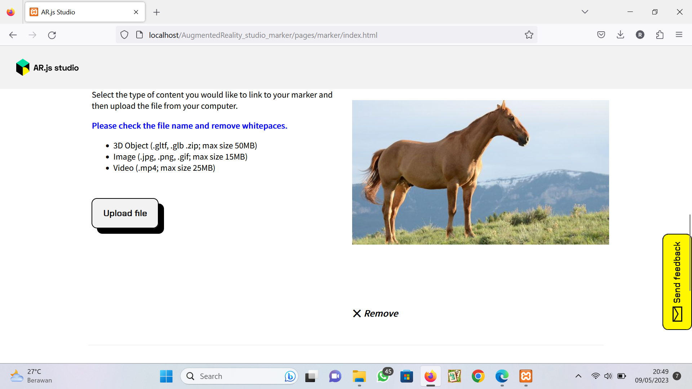
    <br>
 </p>

kemudian klik Download package
 <p align="center">
    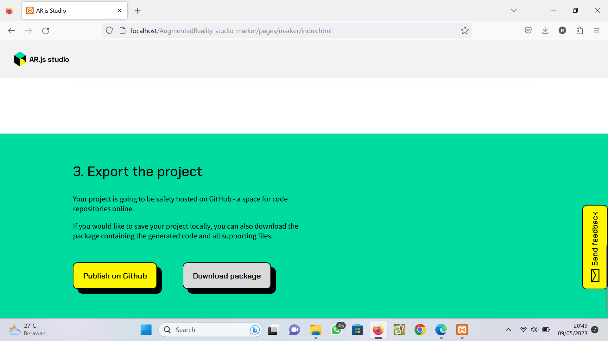
    <br>
 </p>

ektak file lalu pindah file yang sudah di download ke htdoc dan hidupkan xampp
 <p align="center">
    
    <br>
 </p>
 <p align="center">
    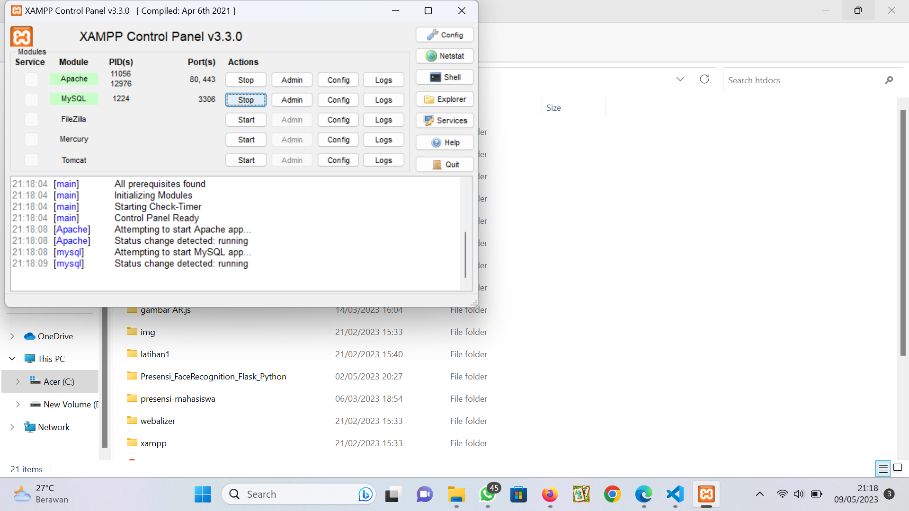
    <br>
 </p>

buka ngrok dan jalankan perintah "ngrok http 80" lalu buka link yang muncul ke ponsel
 <p align="center">
    
    <br>
 </p>
 <p align="center">
    
    <br>
 </p>
 <p align="center">
    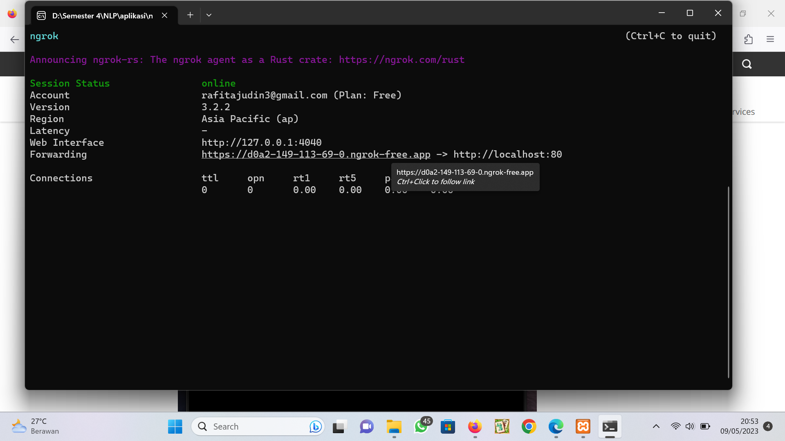
    <br>
 </p>

lalu klik visit site lalu klik file ar(1) / yang di download tadi
 <p align="center">
    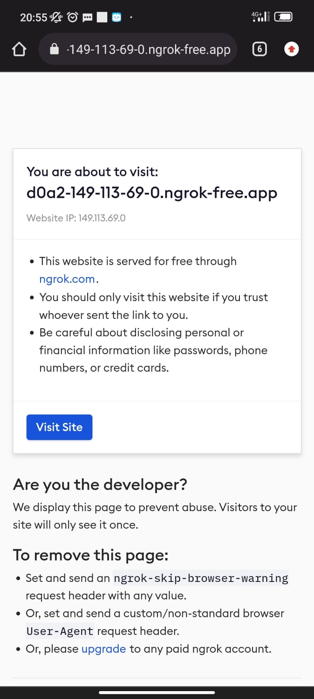
    <br>
 </p>
 <p align="center">
    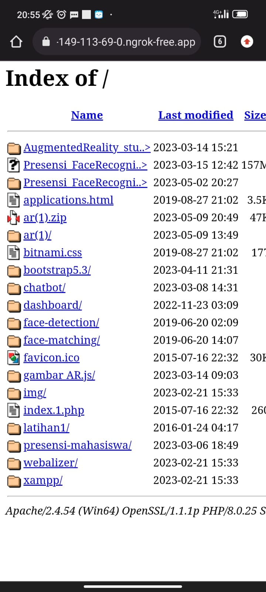
    <br>
 </p>
 
kemudian izin kamera lalu scan gambar pertama seperti pada gambar
 <p align="center">
    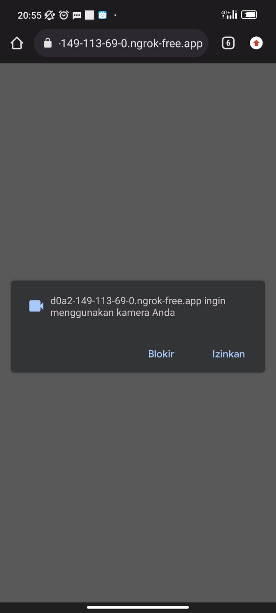
    <br>
 </p>
 <p align="center">
    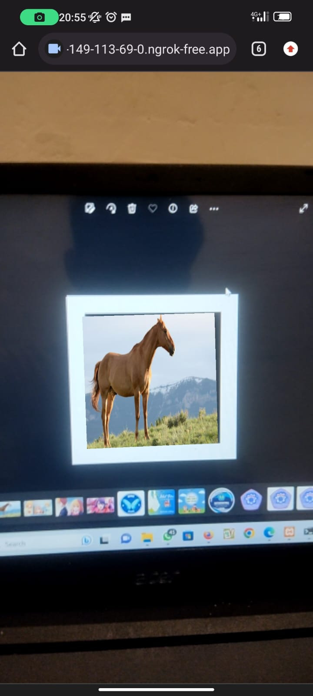
    <br>
 </p>

